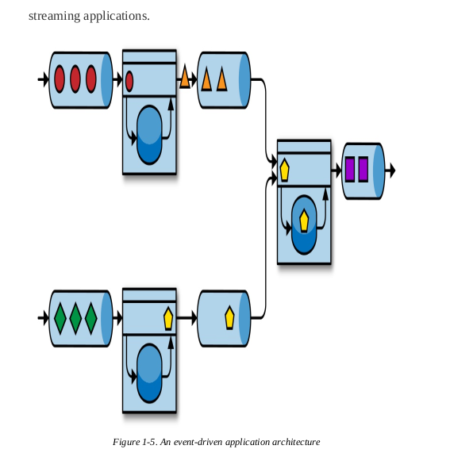
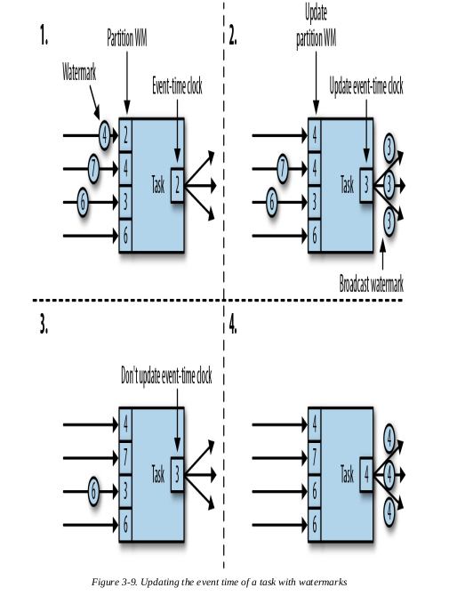
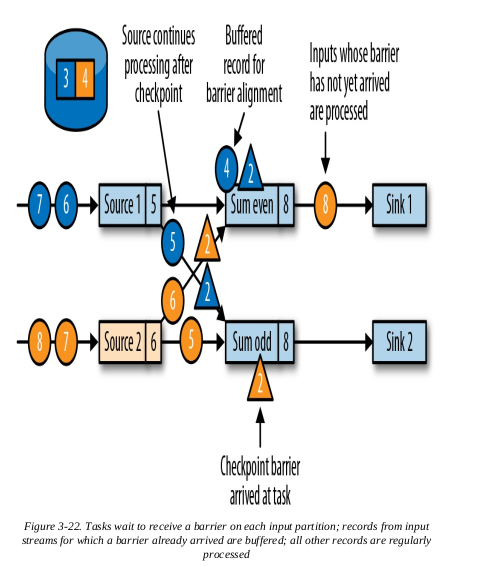
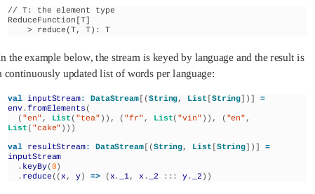
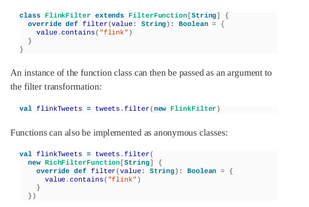
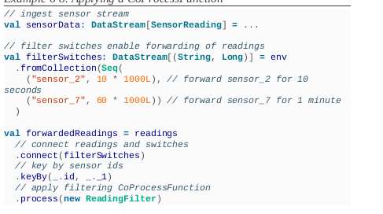
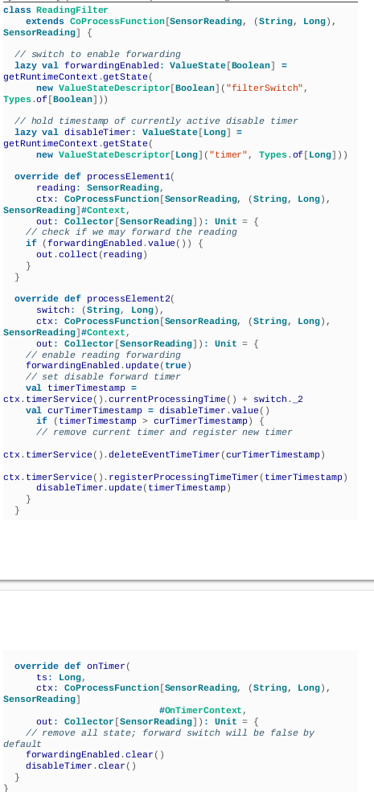
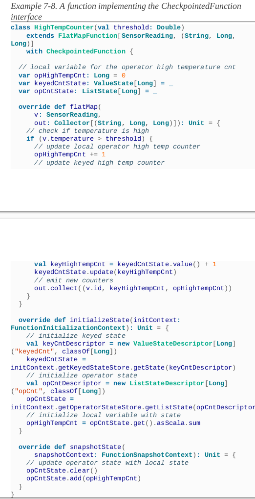

### **Traditional Data Infrastructures:**
- Transactional Processing :When an event is processed, an application
  reads its state or updates it by running transactions against the remote
  database system
  When an event is processed, an application
  reads its state or updates it by running transactions against the remote
  database system.
  This application design can cause problems when applications need to
  evolve or scale. Since multiple applications might work on the samedata representation or share the same infrastructure, changing the
  schema of a table or scaling a database system requires careful
  planning and a lot of effort
  Microservices are designed as small, self-contained, and independent
  applications several microservices with each other that only communicate over
  standardized interfaces such as RESTful HTTP connections.
  

- Analytical Processing : The data that is stored in the various transactional database systems of
  a company can provide valuable insights about a company’s business
  operations


### **Stateful Stream Processing**

Virtually all data is created as continuous streams of events.
Stateful stream processing is an application design pattern for processing unbounded streams of events and is
applicable to many different use cases in the IT infrastructure of a
company.


- Event-Driven Applications
Event-driven applications are stateful streaming applications that ingest
event streams and process the events with application-specific business
logic. Depending on the business logic, an event-driven application can
trigger actions such as sending an alert or an email or write events to an
outgoing event stream to be consumed by another event-driven
application.
  
  - Typical use cases for event-driven applications include:
       
        Real-time recommendations (e.g., for recommending products
          while customers browse a retailer’s website)
      
          Pattern detection or complex event processing (e.g., for fraud
        detection in credit card transactions)
      
          Anomaly detection (e.g., to detect attempts to intrude a
        computer network)
        
         Typical use cases for event-driven applications include:
            Real-time recommendations (e.g., for recommending products
            while customers browse a retailer’s website)
            Pattern detection or complex event processing (e.g., for fraud
            detection in credit card transactions)
            Anomaly detection (e.g., to detect attempts to intrude a
            computer network)
  
- Data Pipelines
  A stream processor that
  operates a data pipeline should also feature many source and sink
  connectors to read data from and write data to various storage systems.
  Again, Flink does all of this.


- Streaming Analytics
  Instead of waiting to be periodically triggered, a streaming analytics
  application continuously ingests streams of events and updates its
  result by incorporating the latest events with low latency.
  


## Chapter 2. Stream Processing Fundamentals

### Introduction to Dataflow Programming

- Dataflow Graphs: dataflow program describes how data flows between operations.
  Dataflow programs are commonly represented as
  directed graphs, where nodes are called operators and representcomputations and edges represent data dependencies.
  convey a high-level view of the computation logic. In order to
  execute a dataflow program, its logical graph is converted into a
  physical dataflow graph(sing a distributed processing engine,
  each operator might have several parallel tasks running on different
  physical machines),

- 
  
- Data Parallelism and Task Parallelism
  partition your input data and have tasks of the same operation execute on the data subsets in parallel
  Data parallelism is useful because it allows for
  processing large volumes of data and spreading the computation loadacross several computing nodes

  Second, you can have tasks from
  different operators. This type of parallelism is called task parallelism.

- Data Exchange Strategies
  Data exchange strategies define how data items are assigned to tasks in
  a physical dataflow graph.
  Data exchange strategies can be
  automatically chosen by the execution engine depending on the
  semantics of the operators or explicitly imposed by the dataflow
  programmer.
  - The forward strategy sends data from a task to a receiving
    task.
  - The broadcast strategy sends every data item to all parallel
    tasks of an operator.
  - The key-based strategy partitions data by a key attribute and
    guarantees that data items having the same key will be
    processed by the same task.
  - The random strategy uniformly distributes data items to
    operator tasks in order to evenly distribute the load acrosscomputing tasks.
  

### Processing Streams in Parallel

- Latency and Throughput
  - LATENCY Latency indicates how long it takes for an event to be processed.
    it is the time interval between receiving an event and
    seeing the effect of processing this event in the output

    you might care about
    average latency, maximum latency, or percentile latency. For example,
    an average latency value of 10 ms means that events are processed
    within 10 ms on average. Alternately, a 95th-percentile latency value
    of 10 ms means that 95% of events are processed within 10 ms.  - 
  - THROUGHPUT . Throughput tells us how many events the system
    can process per time unit.
    In streaming systems you usually want to ensure that your system can
    handle the maximum expected rate of events. That is, you are primarilyconcerned with determining the peak throughput

    backpressure: system continues to
    receive data at a higher rate than it can handle, buffers might become
    unavailable and data might get lost
  - LATENCY VERSUS THROUGHPUT : By processing several streams in parallel, you
    lower the latency while processing more events at the same time.

- Operations on Data Streams
  Operations can be either stateless or stateful.Stateless operations are easy to parallelize, since events can be
  processed independently in the case of a failure, a stateless operator can be simply
  restarted and continue processing from where it left off. In contrast,
  stateful operators may maintain information about the events they have
  received before.
  Stateful stream
  processing applications are more challenging to parallelize and operate
  in a fault-tolerant manner because state needs to be efficiently
  partitioned and reliably recovered in the case of failures.


  - DATA INGESTION AND DATA EGRESS
    Data ingestion and data egress operations allow the stream processor to
    communicate with external systems.
    Data ingestion is the operation of
    fetching raw data from external sources and converting it into a format
    suitable for processing.
    Data egress is
    the operation of producing output in a form suitable for consumptionby external systems.


  - TRANSFORMATION OPERATIONS
    These operations consume one event after the
    other and apply some transformation to the event data, producing a
    new output stream.
    The transformation logic can be either integrated in
    the operator or provided by a user-defined function,
    


  - ROLLING AGGREGATIONS
    A rolling aggregation is an aggregation, such as sum, minimum, and
    maximum, that is continuously updated for each input event.
    Aggregation operations are stateful and combine the current state with
    the incoming event to produce an updated aggregate value.
    


  - WINDOW OPERATIONS
    some operations must collect and buffer records to compute their result.
    Apart from having a practical value, windows also enable semantically
    interesting queries on streams.
    Window operations continuously create finite sets of events called
    buckets from an unbounded event stream and let us perform
    computations on these finite sets. Events are usually assigned to
    buckets based on data properties or based on time.
    - Tumbling windows: assign events into nonoverlapping buckets
      of fixed size.
    
    - 
    
    - Sliding windows, assign events into overlapping buckets of
      fixed size. The slide value defines the interval at which a new
      bucket is created.
    

    - Session windows are useful in common real-world scenarios
      where neither tumbling nor sliding windows can be applied.
    
    
      Real-world systems, networks, and
      communication channels are far from perfect, and streaming data can
      often be delayed or arrive out of order. It is crucial to understand how
      to deliver accurate and deterministic results under such conditions.

### Time Semantics
- What Does One Minute Mean in Stream Processing?

  But there are much more time-
  critical applications whose semantics we need to guarantee.
  If we only
  consider how much data we receive within one minute, our results willvary and depend on the speed of the network connection or the speed
  of the processing. Instead, what really defines the amount of events in
  one minute is the time of the data itself.


- Processing Time
  Processing time is the time of the local clock on the machine where the
  operator processing the stream is being executed.


- Event Time
  Event time is the time when an event in the stream actually happened.


- Watermarks
  A watermark is a global progress metric that indicates the point in time
  when we are confident that no more delayed events will arrive
  Watermarks provide a configurable tradeoff between results confidence
  and latency. Eager watermarks ensure low latency but provide lower
  confidence
  simply relying on watermarks might not always be a good idea.
  Instead, it is crucial that the stream processing system provide some
  mechanism to deal with events that might arrive after the watermark.

- Processing Time Versus Event Time
  processing time can indeed be useful in some cases. Processing-time
  windows introduce the lowest latency possible. Since you do not take
  into consideration late events and out-of-order events, a window
  simply needs to buffer up events and immediately trigger computation
  once the specified time length is reached.

  Thus, for applications where
  speed is more important than accuracy, processing time comes in
  handy
  another case is when you need to periodically report results in
  real time, independently of their accuracy.

  To recap, processing time offers low
  latency but results depend on the speed of processing and are not
  deterministic. On the other hand, event time guarantees deterministic
  results and allows you to deal with events that are late or even out of
  order.

### State and Consistency Models
State is ubiquitous in data processing. Stateful operators use both
incoming events and internal state to compute their output.

To limit the state size, operators usually maintain some kind of summary or
synopsis of the events seen so far.

implementation challenges:

    - State management
      The system needs to efficiently manage the state and make sure it is
      protected from concurrent updates.
    - State partitioning
      Parallelization gets complicated, since results depend on both the
      state and incoming events. Fortunately, in many cases, you can
      partition the state by a key and manage the state of each partition
      independently.
    - State recovery
      The third and biggest challenge that comes with stateful operators
      is ensuring that state can be recovered and results will be correct
      even in the presence of failures


- Task Failures
  Operator state in streaming jobs is very valuable and should be guarded
  against failures provide correctness guarantees about the result
  and operator state.

- WHAT IS A TASK FAILURE?
  For each event in the input stream, a task is a processing step that
  performs the following steps: 
  - (1) receives the event, storing it in a local
    buffer; 
  - (2) possibly updates internal state;
  - (3) produces an outputrecord.

- Result Guarantees
  “result guarantees” we mean the consistency of the internalstate of the stream processor.
  That is, we are concerned with what the
  application code sees as state value after recovering from a failure.
  Note that guaranteeing the consistency of an application’s state is not
  the same a guaranteeing consistency of its output.
  - AT-MOST-ONCE
    The simplest thing to do when a task fails is to do nothing to recover
    lost state and replay lost events.
    events can be simply dropped and nothing is done to ensure result
    correctness. This type of guarantee is also known as “no guarantee”
  - AT-LEAST-ONCE
    In most real-world applications, the expectation is that events should
    not get lost.
    means that all events will be processed, and there is a chance that some of
    them are processed more than once
    In order to ensure at-least-once result correctness, you need to have a
    way to replay events—either from the source or from some buffer.
    Another way to achieve equivalent
    functionality is using record acknowledgments.
    This method stores
    every event in a buffer until its processing has been acknowledged by
    all tasks in the pipeline,
  - EXACTLY-ONCE
    Exactly-once is the strictest guarantee and hard to achieve. Exactly-
    once means that not only will there be no event loss, but also updates
    on the internal state will be applied exactly once for each event.
    Providing exactly-once guarantees requires at-least-once guarantees,
    and thus a data replay mechanism is again necessary. Additionally, the
    stream processor needs to ensure internal state consistency. That is,
    after recovery, it should know whether an event update has already
    been reflected on the state or not.
    Flink uses a lightweight snapshotting mechanism to
    achieve exactly-once result guarantees.
  - END-TO-END EXACTLY-ONCE
    End-to-end guarantees refer
    to result correctness across the whole data processing pipeline. Each
    component provides its own guarantees and the end-to-end guarantee
    of the complete pipeline would be the weakest of each of its
    components

### Summary


## Chapter 3. The Architecture of Apache Flink

### System Architecture
A Flink setup consists of multiple processes that typically
run distributed across multiple machines. Common challenges that
distributed systems need to address are allocation and management of
compute resources in a cluster, process coordination, durable and
highly available data storage, and failure recovery.
Flink does not implement all this functionality by itself. Instead, itfocuses on its core function—distributed data stream processing—and
leverages existing cluster infrastructure and services. Flink is well
integrated with cluster resource managers, such as Apache Mesos,
YARN, and Kubernetes
- The JobManager is the master process that controls the
  execution of a single application—each application is
  controlled by a different JobManager.
  - The JobManager converts the JobGraph into a physical
  dataflow graph called the ExecutionGraph, which consists of
  tasks that can be executed in parallel
  - The JobManager
    requests the necessary resources (TaskManager slots) to
    execute the tasks from the ResourceManager.
  - Once it receives
    enough TaskManager slots, it distributes the tasks of the
    ExecutionGraph to the TaskManagers that execute them.
  - During execution, the JobManager is responsible for all
    actions that require a central coordination such as the
    coordination of checkpoints (see “Checkpoints, Savepoints,
    and State Recovery”).
  

- Flink features multiple ResourceManagers for different
  environments and resource providers such as YARN, Mesos,
  Kubernetes, and standalone deployments.
  - When a JobManager requests TaskManager slots, the
    ResourceManager instructs a TaskManager with idle slots to
    offer them to the JobManager
  - The
    ResourceManager also takes care of terminating idle
    TaskManagers to free compute resources.
  

- TaskManagers are the worker processes of Flink. Typically,
  there are multiple TaskManagers running in a Flink setup.
  - The
    number of slots limits the number of tasks a TaskManager can
    execute. After it has been started, a TaskManager registers its
    slots to the ResourceManager.
  - During execution, a TaskManager
    exchanges data with other TaskManagers that run tasks of the
    same application.
  

- The Dispatcher runs across job executions and provides a
  REST interface to submit applications for execution. Once an
  application is submitted for execution, it starts a JobManager
  and hands the application over.
  The REST interface enables
  the dispatcher to serve as an HTTP entry point to clusters that
  are behind a firewall. The dispatcher also runs a web
  dashboard to provide information about job executions.
  Depending on how an application is submitted for execution
  (discussed in “Application Deployment”), a dispatcher might
  not be required.


- Application Deployment
  - Framework style: , Flink applications are packaged into a JAR file and
    submitted by a client to a running service
    The service can be a
    Flink Dispatcher, a Flink JobManager, or YARN’s
    ResourceManager.
    If the
    application was submitted to a JobManager, it immediately starts to
    execute the application. If the application was submitted to a
    Dispatcher or YARN ResourceManager, it will spin up a
    JobManager and hand over the application, and the JobManager
    will start to execute the application.
  - Library style: n this mode, the Flink application is bundled in an application-
    specific container image, such as a Docker image. The image also
    includes the code to run a JobManager and ResourceManager.

The framework style follows the traditional approach of submitting an
application (or query) via a client to a running service. In the library
style, there is no Flink service. Instead, Flink is bundled as a library
together with the application in a container image. This deployment
mode is common for microservices architectures.

- Task Execution
  A TaskManager can execute several tasks at the same time. These tasks
  can be subtasks of the same operator (data parallelism), a different
  operator (task parallelism), or even from a different application (job
  parallelism).


- Highly Available Setup
  To recover from failures, the system first needs to restart failed
  processes, and second, restart the application and recover its state.

  - TASKMANAGER FAILURES
    t. If
    one of the TaskManagers fails, the number of available slots drops to
    six. In this situation, the JobManager will ask the ResourceManager to
    provide more processing slots. If this is not possible
    The
    application’s restart strategy determines how often the JobManager
    restarts the application and how long it waits between restart attempts.

  - JOBMANAGER FAILURES
    The JobManager controls the execution of a
    streaming application and keeps metadata about its execution, such as
    pointers to completed checkpoints. A streaming application cannot
    continue processing if the responsible JobManager process disappears.
    This makes the JobManager a single point of failure for applications in
    Flink. To overcome this problem, Flink supports a high-availability
    mode that migrates the responsibility and metadata for a job to another
    JobManager in case the original JobManager disappears.
    During the execution of an application, the
    JobManager receives the state handles (storage locations) of the
    individual task checkpoints. Upon completion of a checkpoint—when
    all tasks have successfully written their state into the remote storage—
    the JobManager writes the state handles to the remote storage and a
    pointer to this location to ZooKeepe

- When a JobManager fails, all tasks that belong to its application are
  automatically cancelled. A new JobManager that takes over the work
  of the failed master performs the following steps:
1. It requests the storage locations from ZooKeeper to fetch the
   JobGraph, the JAR file, and the state handles of the last
   checkpoint of the application from the remote storage.
2. It requests processing slots from the ResourceManager to
   continue executing the application.
3. It restarts the application and resets the state of all its tasks to
   the last completed checkpo


### Data Transfer in Flink
The TaskManagers take care of shipping data from sending tasks to
receiving tasks. The network component of a TaskManager collects
records in buffers before they are shipped, i.e., records are not shipped
one by one but batched into buffers. This technique is fundamental to
effectively using the networking resource and achieving high
throughput. The mechanism is similar to the buffering techniques used
in networking or disk I/O protocols


Each TaskManager has a pool of network buffers (by default 32 KB in
size) to send and receive data.

If the sender and receiver tasks run in
separate TaskManager processes, they communicate via the network
stack of the operating system

ach pair of TaskManagers maintains a
permanent TCP connection to exchange data.

    
    - the sender task serializes the outgoing records into a byte
    buffer and puts the buffer into a queue once it is filled
    - The receiving task takes the buffer from the queue and deserializes the incoming
      records.


- Credit-Based Flow Control
  Buffering is needed to fully utilize the
  bandwidth of network connections. In the context of stream processing,
  one disadvantage of buffering is that it adds latency because records
  are collected in a buffer instead of being immediately shipped.
  Flink implements a credit-based flow control mechanism that works as
  follows.
  - A receiving task grants some credit to a sending task, thenumber of network buffers that are reserved to receive its data
  - Once a sender receives a credit notification, it ships as many buffers as it was
    granted and the size of its backlog
  - the number of network buffers that
    are filled and ready to be shipped.
  - The receiver processes the shipped
    data with the reserved buffers and uses the sender’s backlog size to
    prioritize the next credit grants for all its connected senders.
  
- Task Chaining
  two or more
  operators must be configured with the same parallelism and connected
  by local forward channels
  
  
  Task chaining can significantly reduce the communication costs
  between local tasks, but there are also cases when it makes sense to
  execute a pipeline without chaining.
  

### Event-Time Processing
processing time is easy
to understand because it is based on the local time of the processing
machine, it produces somewhat arbitrary, inconsistent, andnonreproducible results. In contrast, event-time semantics yield
reproducible and consistent results, which is a hard requirement for
many stream processing use cases.


- Timestamps
  All records that are processed by a Flink event-time streaming
  application must be accompanied by a timestamp.

  As seen in “Time Semantics”, a certain degree of timestamp out-of-orderness is given in basically allreal-world use cases.


- Watermarks: Flink event-time application must
  also provide watermarks. Watermarks are used to derive the current
  event time at each task in an event-time application.
  Time-based
  operators use this time to trigger computations and make progress. For
  example, a time-window task finalizes a window computation and
  emits the result when the task event-time passes the window’s end
  boundary.

  In Flink, watermarks are implemented as special records holding a
  timestamp as a Long value.
  Watermarks have two basic properties:
  1. They must be monotonically increasing to ensure the event-
     time clocks of tasks are progressing and not going backward.
  2. They are related to record timestamps. A watermark with a
     timestamp T indicates that all subsequent records should have
     timestamps > T.

Tasks of time-based operators collect and process records with possibly
unordered timestamps and finalize a computation when their event-
time clock, which is advanced by the received watermarks, indicates
that no more records with relevant timestamps are expected

. Watermarks that are very
tight—close to the record timestamps—result in low processing latency
because a task will only briefly wait for more records to arrive before
finalizing a computation. At the same time, the result completeness
might suffer because relevant records might not be included in the
result and would be considered as late records. Inversely, very
conservative watermarks increase processing latency but improve
result completeness.

- Watermark Propagation and Event Time
  Flink
  implements watermarks as special records that are received and emitted
  by operator tasks:
  - Tasks have an internal time service that maintains
    timers and is activated when a watermark is received.
  - Tasks can
    register timers at the timer service to perform a computation at a
    specific point in time in the future. For example, a window operator
    registers a timer for every active window, which cleans up the
    window’s state when the event time passes the window’s ending time.
  - When a task receives a watermark, the following actions take place:
    1. The task updates its internal event-time clock based on the
       watermark’s timestamp.
    2. The task’s time service identifies all timers with a time smaller
       than the updated event time. For each expired timer, the task
       invokes a callback function that can perform a computation
       and emit records.
    3. The task emits a watermark with the updated event time.

  - Flink splits data
    streams into partitions and processes each partition in parallel
  - . Each partition is a stream of timestamped
    records and watermarks.
  - records and watermarks from one or more input partitions and emit
    records and watermarks to one or more output partitions.

task emits watermarks to
multiple output tasks and how it advances its event-time clock from the
watermarks it receives from its input tasks.
  - A task maintains a partition watermark for each input partition
  - When
    it receives a watermark from a partition, it updates the respective
    partition watermark to be the maximum of the received value and the
    current value.
  - Subsequently, the task updates its event-time clock to bethe minimum of all partition watermarks.
  - If the event-time clock
    advances, the task processes all triggered timers and finally broadcasts
    its new event time to all downstream tasks by emitting a corresponding
    watermark to all connected output partitions.
   
    The tasks of operators with two or more input streams such as Union
    or CoFlatMap (see “Multistream Transformations”) also compute
    their event-time clock as the minimum of all partition watermarks—

    Flink’s watermark-handling and propagation algorithm ensures
    operator tasks emit properly aligned timestamped records and
    watermarks. However, it relies on the fact that all partitions
    continuously provide increasing watermarks. As soon as one partition
    does not advance its watermarks or becomes completely idle and does
    not ship any records or watermarks, the event-time clock of a task will
    not advance and the timers of the task will not trigger.

    A similar effect appears for operators with two input streams whose
    watermarks significantly diverge. The event-time clocks of a task with
    two input streams will correspond to the watermarks of the slower
    stream and usually the records or intermediate results of the faster
    stream are buffered in state until the event-time clock allows
    processing them.

- Timestamp Assignment and Watermark Generation
  Timestamps and watermarks are
  usually assigned and generated when a stream is ingested by a
  streaming application
  1. At the source: Timestamps and watermarks can be assigned
     and generated by a SourceFunction when a stream is
     ingested into an application.
  2. Periodic assigner: The DataStream API provides a user-
     defined function called
     AssignerWithPeriodicWatermarks that extracts a
     timestamp from each record and is periodically queried for the
     current watermark.
  3. Punctuated assigner:
     AssignerWithPunctuatedWatermarks is another
     user-defined function that extracts a timestamp from each
     record. It can be used to generate watermarks that are encoded
     in special input records. In contrast to the
     AssignerWithPeriodicWatermarks function,

### State Management
In general, all data maintained by a task and used to compute the
results of a function belong to the state of the task. You can think of
state as a local or instance variable that is accessed by a task’s business
logic.

All issues related to state consistency, failure handling, and efficient
storage and access are taken care of by Flink so that developers can
focus on the logic of their applications.


In Flink, state is always associated with a specific operator.
In order to
make Flink’s runtime aware of the state of an operator, the operator
needs to register its state. There are two types of state, operator state
and keyed state,

- Operator State
  Operator state is scoped to an operator task. This means that all records
  processed by the same parallel task have access to the same state.
  Operator state cannot be accessed by another task of the same or a
  different operator.

  
  - List state: Represents state as a list of entries.
  - Union list state: Represents state as a list of entries as well. But it differs from
    regular list state in how it is restored in the case of a failure or when
    an application is started from a savepoint.
  - Broadcast state: Designed for the special case where the state of each task of an
    operator is identical. This property can be leveraged during
    checkpoints and when rescaling an operator.

- Keyed State:
  Keyed state is maintained and accessed with respect to a key defined in
  the records of an operator’s input stream.


  Flink maintains one state
  instance per key value and partitions all records with the same key to
  the operator task that maintains the state for this key.
  all records with the same key access
  the same state
  

  - Value state:Stores a single value of arbitrary type per key. Complex data
    structures can also be stored as value state.
  - List state: Stores a list of values per key. The list entries can be of arbitrary
    type.
  - Map state: Stores a key-value map per key. The key and value of the map can
    be of arbitrary type.


- State Backends
  A task of a stateful operator typically reads and updates its state for
  each incoming record.
  state is
  stored, accessed, and maintained is determined by a pluggable
  component that is called a state backend.$
  A state backend is
  responsible for two things: local state management and checkpointing
  state to a remote location.
  For local state management, a state backend stores all keyed states and
  ensures that all accesses are correctly scoped to the current key.
  . Another state backend
  serializes state objects and puts them into RocksDB, which writes themto local hard disks. While the first option gives very fast state access, it
  is limited by the size of the memory.

  . A state backend takes care of
  checkpointing the state of a task to a remote and persistent storage.

  The
  remote storage for checkpointing could be a distributed filesystem or a
  database system. State backends differ in how state is checkpointed.

  - Scaling Stateful Operators
    Flink
    supports four patterns for scaling different types of state.
    - Operators with keyed state are scaled by repartitioning keys to fewer or
    more tasks. However, to improve the efficiency of the necessary statetransfer between tasks,
    Flink does not redistribute individual keys.
    Instead, Flink organizes keys in so-called key groups
    
    - Operators with operator list state are scaled by redistributing the list
      entries.
    
    - Operators with operator union list state are scaled by broadcasting the
      full list of state entries to each task. The task can then choose which
      entries to use and which to discard.
    
    - Operators with operator broadcast state are scaled up by copying the
      state to new tasks.
    
    
### Checkpoints, Savepoints, and State Recovery
- Consistent Checkpoints
  Flink’s recovery mechanism is based on consistent checkpoints of
  application state.
  consistent checkpoint of a stateful streaming
  application is a copy of the state of each of its tasks at a point when all
  tasks have processed exactly the same input.
  1. Pause the ingestion of all input streams.
  2. Wait for all in-flight data to be completely processed, meaning
     all tasks have processed all their input data.
  3. Take a checkpoint by copying the state of each task to a
     remote, persistent storage. The checkpoint is complete when
     all tasks have finished their copies.
  4. Resume the ingestion of all streams.
  
- Recovery from a Consistent Checkpoint
  During the execution of a streaming application, Flink periodically
  takes consistent checkpoints of the application’s state. In case of a
  failure, Flink uses the latest checkpoint to consistently restore the
  application’s state and restarts the processing.
  

  An application is recovered in three steps:
  1. Restart the whole application.
  2. Reset the states of all stateful tasks to the latest checkpoint.
  3. Resume the processing of all tasks.
  
  This checkpointing and recovery mechanism can provide exactly-once
  consistency for application state, given that all operators checkpoint
  and restore all of their states
  application can only
  be operated under exactly-once state consistency if all input streams are
  consumed by resettable data sources.
  Although this means Flink processes some
  messages twice (before and after the failure), the mechanism still
  achieves exactly-once state consistency because the state of all
  operators was reset to a point that had not seen this data yet.
  . For some
  storage systems, Flink provides sink functions that feature exactly-once
  output, for example, by committing emitted records on checkpoint
  completion.


- Flink’s Checkpointing Algorithm
  Flink’s recovery mechanism is based on consistent application
  checkpoints. 
  The naive approach to taking a checkpoint from a
  streaming application—to pause, checkpoint, and resume the
  application
  Flink implements checkpointing based on the Chandy–Lamport
  algorithm for distributed snapshots.


    Flink’s checkpointing algorithm uses a special type of record called a
    checkpoint barrier
    Similar to watermarks, checkpoint barriers are
    injected by source operators into the regular stream of records and
    cannot overtake or be passed by other records.
    
    A checkpoint barrier
    carries a checkpoint ID to identify the checkpoint it belongs to andlogically splits a stream into two parts.
    - All state modifications due to records that precede a barrier are included in the barrier’s checkpoint
    - all modifications due to records that follow the barrier are included in a later checkpoint.

  
  
  When a data source task receives the message, it pauses emitting
  records, triggers a checkpoint of its local state at the state backend, and
  broadcasts checkpoint barriers with the checkpoint ID via all outgoing
  stream partitions.
  The state backend notifies the task once its state
  checkpoint is complete and the task acknowledges the checkpoint at
  the JobManager. After all barriers are sent out, the source continues its
  regular operations.
  
  When a task receives abarrier for a new checkpoint, it waits for the arrival of barriers from all
  its input partitions for the checkpoint.
  While it is waiting, it continues
  processing records from stream partitions that did not provide a barrier
  yet.

  

  The process of waiting for all
  barriers to arrive is called barrier alignment, and it is depicted in

  As soon as a task has received barriers from all its input partitions, it
  initiates a checkpoint at the state backend and broadcasts the
  checkpoint barrier to all of its downstream connected tasks
  
  Once all checkpoint barriers have been emitted, the task starts to
  process the buffered records.
  After all buffered records have been
  emitted, the task continues processing its input streams. Figure 3-24
  shows the application at this point
  
  Eventually, the checkpoint barriers arrive at a sink task. When a sink
  task receives a barrier, it performs a barrier alignment. checkpoints its
  own state, and acknowledges the reception of the barrier to the
  JobManager.
  The JobManager records the checkpoint of an application
  as completed once it has received a checkpoint acknowledgement from
  all tasks of the application.
  The completed checkpoint can be used to
  recover the application
  


- Performace Implications of Checkpointing
  Flink’s checkpointing algorithm produces consistent distributed
  checkpoints from streaming applications without stopping the whole
  application. However, it can increase the processing latency

  While a task checkpoints its state, it is blocked and its input is buffered.
  Since state can become quite large and checkpointing requires writing
  the data over the network to a remote storage system


    In Flink’s design it is the
    responsibility of the state backend to perform a checkpoint. How
    exactly the state of a task is copied depends on the implementation of
    the state backend
  
    For example, the FileSystem state backend and the
    RocksDB state backend support asynchronous checkpoints.
  
    A background thread asynchronously copies the local
    snapshot to the remote storage and notifies the task once it completes
    the checkpoint
  
    RocksDB
    state backend also features incremental checkpointing, which reduces
    the amount of data to transfer.
    
    Another technique to reduce the checkpointing algorithm’s impact on
    the processing latency is to tweak the barrier alignment step. For
    applications that require very low latency and can tolerate at-least-once
    state guarantees, Flink can be configured to process all arriving records
    during buffer alignment instead of buffering those for which the barrier
    has already arrived


- Savepoints
  Flink’s recovery algorithm is based on state checkpoints.

  Flink does not automatically take a savepoint, so a user (or
  external scheduler) has to explicitly trigger its creation
  - USING SAVEPOINTS
    - You can start a different but compatible application from a
      savepoint. Hence, you can fix bugs in your application logic
      and reprocess as many events as your streaming source can
      provide in order to repair your results
      - un A/B tests or what-if scenarios with
        different business logic
    - You can start the same application with a different parallelism
      and scale the application out or in.
    - You can start the same application on a different cluster. This
      allows you to migrate an application to a newer Flink version
      or to a different cluster or data-center.
    - You can use a savepoint to pause an application and resume it
      later. This gives the possibility to release cluster resources for
      higher-priority applications
    - You can also just take a savepoint to version and archive the
      state of an application.

  - STARTING AN APPLICATION FROM A SAVEPOINT
    


## Chapter 5. The DataStream API

### Transformations
The DataStream API provides transformations for the most common
data transformation operations.


We present the
transformations of the DataStream API in four categories:
1. Basic transformations are transformations on individual
   events.
2. KeyedStream transformations are transformations that are
   applied to events in the context of a key.
3. Multistream transformations merge multiple streams into one
   stream or split one stream into multiple streams.
4. Distribution transformations reorganize stream events.

Basic Transformations
   - MAP
     The map transformation is specified by calling
     the DataStream.map() method and produces a new DataStream
     
     

   - FILTER: 
     The filter transformation drops or forwards events of a stream by
     evaluating a boolean condition on each input event
     
     

   - FLATMAP
     The flatMap transformation applies a function on each incoming event.
     The corresponding FlatMapFunction defines the flatMap()
     method, which may return zero, one, or more events as results by
     passing them to the Collector object
     
     
- KeyedStream Transformations
  - KEYBY
    The keyBy transformation converts a DataStream into a
    KeyedStream by specifying a key.
    Based on the key, the events of
    the stream are assigned to partitions, so that all events with the same
    key are processed by the same task of the subsequent operator
    
    
  
  - ROLLING AGGREGATIONS
    Rolling aggregation transformations are applied on a
    KeyedStream and produce a DataStream of aggregates, such as
    sum, minimum, and maximum
    For each incoming event, the
    operator updates the corresponding aggregate value and emits an event
    with the updated value.
    A rolling aggregation does not require a user-
    defined function but receives an argument that specifies on which field
    the aggregate is computed.
    

      sum()
      A rolling sum of the input stream on the specified field.
      min()
      A rolling minimum of the input stream on the specified field.
      max()
      A rolling maximum of the input stream on the specified field.
      minBy()
      A rolling minimum of the input stream that returns the event with
      the lowest value observed so far.
      maxBy()
      A rolling maximum of the input stream that returns the event with
      the highest value observed so far.
  
  - REDUCE
    The reduce transformation is a generalization of the rolling
    aggregation. It applies a ReduceFunction on a KeyedStream,
    which combines each incoming event with the current reduced value,
    and produces a DataStream.
    


- Multistream Transformations
   - UNION
     The DataStream.union() method merges two or more
     DataStreams of the same type and produces a new
     DataStream of the same type.
     
     The events are merged in a FIFO fashion—the operator does not
     produce a specific order of events.
     Moreover, the union operator does
     not perform duplication elimination
    
   - CONNECT, COMAP, AND COFLATMAP
     The DataStream.connect() method receives a
     DataStream and returns a ConnectedStreams object, which
     represents the two connected streams:
     one for each input. map1() and flatMap1() are called to process
     an event of the first input and map2() and flatMap2() are invoked
    
     
     connect() does not establish a relationship between the events of
     both streams
     on ConnectedStreams, connect() can be combined with
     keyBy() or broadcast(). We first show the keyBy() case:
     
     The next example shows how to connect a (nonkeyed) DataStream
     with a broadcasted stream:
     
   - 
   - SPLIT AND SELECT
     Split is the inverse transformation to the union transformation
     Each incoming event can be routed to zero,
     one, or more output streams.
     
     The DataStream.split() method receives an
     OutputSelector that defines how stream elements are assigned to
     named outputs.
     The OutputSelector defines the select()
     method that is called for each input event and returns a
     java.lang.Iterable[String].
     
  


- Distribution Transformations
  operations define how events are assigned to tasks
  When building applications with the
  DataStream API the system automatically chooses data partitioning
  strategies and routes data to the correct destination depending on the
  operation semantics and the configured parallelism
  
  - Random
    The random data exchange strategy is implemented by the
    DataStream.shuffle() method. The method distributes
    records randomly according to a uniform distribution to the parallel
    tasks of the following operator.
  - Round-Robin
    The rebalance() method partitions the input stream so that
    events are evenly distributed to successor tasks in a round-robin
    fashion
  - Rescale
    The rescale() method also distributes events in a round-robin
    fashion, but only to a subset of successor tasks
    rebalance() will create communication channels between all
    sending tasks to all receiving tasks, rescale() will only create
    channels from each task to some of the tasks of the downstream
    operator.
  
  - Broadcast
    The broadcast() method replicates the input data stream so
    that all events are sent to all parallel tasks of the downstream
    operator.
  - Global
    The global() method sends all events of the input data stream to
    the first parallel task of the downstream operator. This partitioning
    strategy must be used with care, as routing all events to the same
    task might impact application performance.
  - Custom
    custom
    When none of the predefined partitioning strategies is suitable, you
    can define your own by using the partitionCustom()
    method. This method receives a Partitioner object that
    implements the partitioning logic and the field or key position on
    which the stream is to be partitioned
    
  - 

### Setting the Parallelism
The number of parallel tasks of
an operator is called the parallelism of the operator
The number of parallel tasks of
an operator is called the parallelism of the operator
In general, it is a good idea to define the parallelism of your operators
relative to the default parallelism of the environment


The default parallelism of an operator can be overridden by specifying
it explicitly


### Types
Flink uses the concept of type information to represent data
types and generate specific serializers, deserializers, and comparators
for every data type.
- Supported Data Types :
  - Primitives 
  - Java and Scala tuples 
  - Scala case classes 
  - POJOs, including classes generated by Apache Avro 
  - Some special types
  Types that are not specially handled are treated as generic types and
  serialized using the Kryo serialization framework.
    
  POJOs
    Flink analyzes each type that does not fall into any category and
    checks to see if it can be identified and handled as a POJO type.
    Flink accepts a class as a POJO if it satisfies the following
    conditions:
    - It is a public class.
    - It has a public constructor without any arguments—a defaultconstructor.
    - All fields are public or accessible through getters and setters.
    - The getter and setter functions must follow the default
    naming scheme, which is Y getX() and setX(Y x) for a
    field x of type Y.
    - All fields have types that are supported by Flink.
    


- Creating Type Information for Data Types
  The central class in Flink’s type system is TypeInformation. It
  provides the system with the necessary information it needs to generate
  serialiazers and comparators.

  Flink provides two utility classes for Java and Scala with static
  methods to generate a TypeInformation. For Java, the helper class
  is org.apache.flink.api.common.typeinfo.Types
  


- Explicitly Providing Type Information
  In some cases Flink
  might not choose the TypeInformation that generates the most
  efficient serializers and deserializers. Hence, you might need to
  explicitly provide TypeInformation objects to Flink for some of
  the data types used in your application.
  


### Defining Keys and Referencing Fields
 
- Field Positions
 
- Field Expressions
  
- Key Selectors
  


### Implementing Functions

- Function Classes
  Flink exposes all interfaces for user-defined functions, such as
  MapFunction, FilterFunction, and ProcessFunction, as
  interfaces or abstract classes.
 
  
  
  

- Lambda Functions

- Rich Functions
  Oftentimes there is a need to initialize a function before it processes thefirst record or to retrieve information about the context in which it is
  executed
  The DataStream API provides rich functions that expose
  more functionality than the regular functions discussed until now.
  RichMapFunction, RichFlatMapFunction, and so on.
  - The open() method is an initialization method for the rich
    function. It is called once per task before a transformation
    method like filter or map is called.
  - The close() method is a finalization method for the
    function and it is called once per task after the last call of the
    transformation method.


### Including External and Flink Dependencies
When an application is executed, all of its dependencies must be
available to the application. By default, only the core API
dependencies (DataStream and DataSet APIs) are loaded by a Flink
cluster. All other dependencies an application requires must be
explicitly provided.

different connectors or directly from the user application.
There are two ways to ensure all dependencies are available to an
application when it is executed:
1. Bundle all dependencies into the application JAR file. This
   yields a self-contained, yet typically quite large, application
   JAR file.
2. The JAR file of a dependency can be added to the ./lib folder
   of a Flink setup. In this case, the dependencies are loaded into
   the classpath when Flink processes are started. A dependencythat is added to the classpath like this is available to (and
   might interfere with) all applications that run on the Flink
   setup .


## Chapter 6. Time-Based and Window Operators
In this chapter, we will cover DataStream API methods for time
handling and time-based operators, like windows.


### Configuring Time Characteristics
The time characteristic is a property of the
StreamExecutionEnvironment and it takes the following
values:
- ProcessingTime
  Processing-time windows trigger based on machine
  time and include whatever elements happen to have arrived at the
  operator until that point in time.
  using processing time
  for window operations results in nondeterministic results because
  the contents of the windows depend on the speed at which the
  elements arrive
  This setting offers very low latency because
  processing tasks do not have to wait for watermarks


- EventTime
  Each event carries a timestamp and
  the logical time of the system is defined by watermarks.
  An event-time window triggers when the
  watermarks declare that all timestamps for a certain time interval
  have been received.  


- IngestionTime
  specifies the processing time of the source operator as an event
  time timestamp to each ingested record and automatically generates
  watermarks. It is a hybrid of EventTime and
  ProcessingTime.


- Assigning Timestamps and Generating Watermarks
  application needs to
  provide two important pieces of information to Flink in order to
  operate in event time.
  - event must be associated with a timestamp
  - Event-time streams also need to carry watermarks from which operators infer the
    current event time.
    
  Timestamps and watermarks are specified in milliseconds since the
   epoch of 1970-01-01T00:00:00Z
  Timestamps and watermarks can be either
  assigned and generated by a SourceFunction or using an explicit
  user-defined timestamp assigner and watermark generator
  - The DataStream API provides the TimestampAssigner interface
    to extract timestamps from elements after they have been ingested into
    the streaming application
  - the timestamp assigner is called
    right after the source function because most assigners make
    assumptions about the order of elements with respect to theirtimestamps when generating watermarks.
  - It is best practice to assign timestamps and generate watermarks as
    close to the sources as possible or even within the
    SourceFunction.
  - Depending on the use case, it is possible to apply
    an initial filtering or transformation on the input stream before
    assigning timestamps if such operations do not induce a redistribution
    of elements.
  
  - MyAssigner can either be of type
    AssignerWithPeriodicWatermarks or
    AssignerWithPunctuatedWatermarks. These two interfaces
    extend the TimestampAssigner
    . The first interface defines assigners that emit
    watermarks periodically while the second injects watermarks based on
    a property of the input events.


    - ASSIGNER WITH PERIODIC WATERMARKS
     Assigning watermarks periodically means that we instruct the system
    to emit watermarks and advance the event time in fixed intervals of
    machine time.
     The default interval is set to two hundred milliseconds,
      but it can be configured using the
    ```
      val env = StreamExecutionEnvironment.getExecutionEnvironment
      env.setStreamTimeCharacteristic(TimeCharacteristic.EventTime)
      // generate watermarks every 5 seconds
      env.getConfig.setAutoWatermarkInterval(5000)
    ```

    getCurrentWatermark() method of AssignerWithPeriodicWatermarks. If the method returns a
    nonnull value with a timestamp larger than the timestamp of the
    previous watermark, the new watermark is forwarded.
    
    When asked for a new watermark, the assigner returns a
    watermark with the maximum timestamp minus a 1-minute tolerance
    interval.
  
    ```
     class PeriodicAssigner
      extends AssignerWithPeriodicWatermarks[SensorReading] {
      val bound: Long = 60 * 1000
      // 1 min in ms
      var maxTs: Long = Long.MinValue // the maximum observed
      timestamp
      override def getCurrentWatermark: Watermark = {
      // generated watermark with 1 min tolerance
      new Watermark(maxTs - bound)
      }
      override def extractTimestamp(
      r: SensorReading,
      previousTS: Long): Long = {
      // update maximum timestamp
      maxTs = maxTs.max(r.timestamp)
      // return record timestamp
      r.timestamp
      }
    }
    ```

    The DataStream API provides implementations for two common cases
    of timestamp assigners with periodic watermarks.
      - input elements have timestamps that are monotonically increasing, you can use the shortcut method assignAscendingTimeStamps.
      ```
      val stream: DataStream[SensorReading] = ...
      val withTimestampsAndWatermarks = stream
      .assignAscendingTimestamps(e => e.timestamp)
      ```

      - maximum lateness that you will encounter in the input stream
       the maximum difference between an element’s timestamp and the
      largest timestamp of all perviously ingested elements. For such cases,
      Flink provides the
      BoundedOutOfOrdernessTimeStampExtractor
      ```
       val stream: DataStream[SensorReading] = ...
        val output = stream.assignTimestampsAndWatermarks(
        new BoundedOutOfOrdernessTimestampExtractor[SensorReading](
        Time.seconds(10))(e =>.timestamp)
      ```


    - ASSIGNER WITH PUNCTUATED WATERMARKS
    Sometimes the input stream contains special tuples or markers that
    indicate the stream’s progress. Flink provides the
    AssignerWithPunctuatedWatermarks interface for such
    cases, or when watermarks can be defined based on some other
    property of the input elements
    
    ```
    class PunctuatedAssigner
    extends AssignerWithPunctuatedWatermarks[SensorReading] {
      val bound: Long = 60 * 1000 // 1 min in ms
      override def checkAndGetNextWatermark(
      r: SensorReading,
      extractedTS: Long): Watermark = {
      if (r.id == "sensor_1") {
        // emit watermark if reading is from sensor_1
        new Watermark(extractedTS - bound)
      } else {
        // do not emit a watermark
        null
      }
      }
      override def extractTimestamp(
      r: SensorReading,previousTS: Long): Long = {
        // assign record timestamp
        r.timestamp
      }
    }
    ```


- Watermarks, Latency, and Completeness
  Watermarks are used to balance latency and result completeness.
  An operator based on event time uses watermarks to determine
  the completeness of its ingested records and the progress of its
  operation


### Process Functions
The DataStream API provides a family of low-level transformations,
the process functions, which can also access record timestamps and
watermarks and register timers that trigger at a specific time in the
future.

Process functions are commonly used to
build event-driven applications and to implement custom logic for
which predefined windows and transformations might not be suitable.

Currently, Flink provides eight different process functions:
ProcessFunction, KeyedProcessFunction,
CoProcessFunction, ProcessJoinFunction,
BroadcastProcessFunction,
KeyedBroadcastProcessFunction,
ProcessWindowFunction, and
ProcessAllWindowFunction.

All process
functions implement the RichFunction interface and hence offer
open(), close(), and getRuntimeContext() methods.
Additionally, a KeyedProcessFunction[KEY, IN, OUT], provides the following two methods:
1. processElement(v: IN, ctx: Context, out:
   Collector[OUT]) is called for each record of the stream.
   As usual, result records are emitted by passing them to the
   Collector.
   The Context object is what makes a process
   function special. It gives access to the timestamp and the key
   of the current record and to a TimerService. Moreover,
   the Context can emit records to side outputs.
2. onTimer(timestamp: Long, ctx:
   OnTimerContext, out: Collector[OUT]) is a
   callback function that is invoked when a previously registered
   timer triggers.
   The timestamp argument gives the timestamp
   of the firing timer and the Collector allows records to be
   emitted. The OnTimerContext provides the same services
   as the Context object of the processElement() method
   and also returns the time domain


- TimerService and Timers
  The TimerService of the Context and OnTimerContext
  objects offers the following methods:
  - currentProcessingTime(): Long returns the current
    processing time.
  - currentWatermark(): Long returns the timestamp ofthe current watermark.
  - registerProcessingTimeTimer(timestamp:
    Long): Unit registers a processing time timer for the
    current key.
  - registerEventTimeTimer(timestamp: Long):
    Unit registers an event-time timer for the current key.
  - deleteProcessingTimeTimer(timestamp:
    Long): Unit deletes a processing-time timer that was
    previously registered for the current key.
  - deleteEventTimeTimer(timestamp: Long):
    Unit deletes an event-time timer that was previously
    registered for the current key.
  
  When a timer fires, the onTimer() callback function is called. The
  processElement() and onTimer() methods are synchronized to
  prevent concurrent access and manipulation of state.


  For each key and timestamp, exactly one timer can be registered, which
  means each key can have multiple timers but only one for each
  timestamp
  Timers are checkpointed along with any other state of the function.

  The following code shows how to apply a
  KeyedProcessFunction to a KeyedStream. The function
  monitors the temperatures of sensors and emits a warning if the
  temperature of a sensor monotonically increases for a period of 1
  second in processing time:
  
    ```scala 
    val warnings = readings
    // key by sensor id
    .keyBy(_.id)
    // apply ProcessFunction to monitor temperatures
    .process(new TempIncreaseAlertFunction)
  
    /** Emits a warning if the temperature of a sensor
    * monotonically increases for 1 second (in processing time).
      */
      class TempIncreaseAlertFunction
      extends KeyedProcessFunction[String, SensorReading, String]
      {
        // stores temperature of last sensor reading
        lazy val lastTemp: ValueState[Double] =
        getRuntimeContext.getState(
        new ValueStateDescriptor[Double]("lastTemp",
        Types.of[Double]))
        // stores timestamp of currently active timer
        lazy val currentTimer: ValueState[Long] =
        getRuntimeContext.getState(
        new ValueStateDescriptor[Long]("timer", Types.of[Long]))
        override def processElement(
        r: SensorReading,
        ctx: KeyedProcessFunction[String, SensorReading,
        String]#Context,
        out: Collector[String]): Unit = {
        // get previous temperature
        val prevTemp = lastTemp.value()
        // update last temperature
        lastTemp.update(r.temperature)
        val curTimerTimestamp = currentTimer.value();
        if (prevTemp == 0.0 || r.temperature < prevTemp) {
        // temperature decreased; delete current timer
        ctx.timerService().deleteProcessingTimeTimer(curTimerTimestamp)
        currentTimer.clear()} else if (r.temperature > prevTemp && curTimerTimestamp ==
    0) {
       // temperature increased and we have not set a timer yet
       // set processing time timer for now + 1 second
       val timerTs = ctx.timerService().currentProcessingTime()
    + 1000
      ctx.timerService().registerProcessingTimeTimer(timerTs)
      // remember current timer
      currentTimer.update(timerTs)
      }
      }
      override def onTimer(
      ts: Long,
      ctx: KeyedProcessFunction[String, SensorReading,
      String]#OnTimerContext,
      out: Collector[String]): Unit = {
      out.collect("Temperature of sensor '" + ctx.getCurrentKey +
      "' monotonically increased for 1 second.")
      currentTimer.clear()
      }
      }
    ```

- Emitting to Side Outputs
  Side outputs are a feature of process functions to emit multiple
  streams from a function with possibly different types.
  . A side output is
  identified by an OutputTag[X] object, where X is the type of the
  resulting side output stream.
  
  


- CoProcessFunction
  For low-level operations on two inputs, the DataStream API also
  provides the CoProcessFunction. Similar to a
  CoFlatMapFunction, a CoProcessFunction offers a
  transformation method for each input, processElement1() and
  processElement2()
  
  

### Window Operators
Window operators provide a way to group events in
buckets of finite size and apply computations on the bounded contents
of these buckets.

- Defining Window Operators
  Window operators can be applied on a keyed or a nonkeyed stream.
  Window operators on keyed windows are evaluated in parallel, and
  nonkeyed windows are processed in a single thread.
  To create a window operator, you need to specify two window
  components:
  1. A window assigner that determines how the elements of the
     input stream are grouped into windows. A window assigner
     produces a WindowedStream (or AllWindowedStream
     if applied on a nonkeyed DataStream).
  2. A window function that is applied on a WindowedStream
     (or AllWindowedStream) and processes the elements that
     are assigned to a window.
  
  
- Built-in Window Assigners
  Time-based window
  assigners assign an element based on its event-time timestamp or the
  current processing time to windows.
  All built-in window assigners provide a default trigger that triggers the
  evaluation of a window once the (processing or event) time passes the
  end of the window.

  It is important to note that a window is created
  when the first element is assigned to it. Flink will never evaluate empty
  windows.
  
  - TUMBLING WINDOWS
    A tumbling window assigner places elements into nonoverlapping,
    fixed-size windows
   
    The Datastream API provides two assigners
    —TumblingEventTimeWindows and TumblingProcessingTimeWindows
   
    timeWindow(size)
    method, which is a shortcut for either window.
    (TumblingEventTimeWindows.of(size)) or for window.
    (TumblingProcessingTimeWindows.of(size)) depending
    on the configured time characteristic
   
    By default, tumbling windows are aligned to the epoch time, 1970-
    01-01-00:00:00.000. For example, an assigner with a size of one
    hour will define windows at 00:00:00, 01:00:00, 02:00:00, and so on.
    Alternatively, you can specify an offset as a second parameter in theassigner. The following code shows windows with an offset of 15
    minutes that start at 00:15:00, 01:15:00, 02:15:00, and so on:
   
  - SLIDING WINDOWS
    The sliding window assigner assigns elements to fixed-sized windows
    that are shifted by a specified slide interval,
    
    
  - SESSION WINDOWS
    A session window assigner places elements into nonoverlapping
    windows of activity of varying size. The boundaries of session
    windows are defined by gaps of inactivity,
    
    
  
- Applying Functions on Windows
  Window functions define the computation that is performed on the
  elements of a window.
  - Incremental aggregation functions are directly applied when
    an element is added to a window and hold and update a single
    value as window state.
  - Full window functions collect all elements of a window and
    iterate over the list of all collected elements when they are
    evaluated.
  - REDUCEFUNCTION
    A ReduceFunction accepts two values of the same type
    and combines them into a single value of the same type.
    The advantages of applying ReduceFunction on a window are the
    constant and small state size per window and the simple function
    interface.
    
   
  - AGGREGATEFUNCTION
    AggregateFunction is also
    incrementally applied to the elements that are applied to a window.
    Moreover, the state of a window operator with an
    AggregateFunction also consists of a single value
    While the interface of the AggregateFunction is much more
    flexible, it is also more complex to implement compared to the
    interface of the ReduceFunction.
   
   
  
  - PROCESSWINDOWFUNCTION
    ReduceFunction and AggregateFunction are incrementallyapplied on events that are assigned to a window. However, sometimes
    we need access to all elements of a window to perform more complex
    computations, such as computing the median of values in a window or
    the most frequently occurring value.
   
    The process() method is called with the key of the window, an
    Iterable to access the elements of the window, and a Collector
    to emit result
    The Context object of the
    ProcessWindowFunction gives access to the metadata of the
    window, the current processing time and watermark, state stores to
    manage per-window and per-key global states,
    Another feature are per-window and per-key global states. Global state
    refers to the keyed state that is not scoped to any window, while per-
    window state refers to the window instance that is currently being
    evaluated.
  
  - INCREMENTAL AGGREGATION AND PROCESSWINDOWFUNCTION
  
  
  

- Customizing Window Operators
  - When an element arrives at a window operator, it is handed to the
  WindowAssigner. The assigner determines to which windows the
  element needs to be routed. If a window does not exist yet, it is created.

  - If the window operator is configured with an incremental aggregationfunction, such as a ReduceFunction or AggregateFunction,
  the newly added element is immediately aggregated and the result is
  stored as the contents of the window. If the window operator does not
  have an incremental aggregation function, the new element is appended
  to a ListState that holds all assigned elements.
 
  - Every time an element is added to a window, it is also passed to the
    trigger of the window. The trigger defines (fires) when a window is
    considered ready for evaluation and when a window is purged and its
    contents are cleared. A trigger can decide based on assigned elements
    or registered timers (similar to a process function)
  
  
  If the operator only has a full window function, the function is applied
  on all elements of the window and the result is emitted as shown in
  
  Finally, if the operator has an incremental aggregation function and a
  full window function, the full window function is applied on the
  aggregated value and the result is emitted.
  
  The evictor is an optional component that can be injected before or
  after a ProcessWindowFunction is called. An evictor can remove
  collected elements from the contents of a window. Since it has to
  iterate over all elements, it can only be used if no incremental
  aggregation function is specified.
  

  - WINDOW LIFECYCLE
    - Window content
    - Window object
    - Timers of a trigger
    - Custom-defined state in a trigger


### Joining Streams on Time
Flink’s DataStream API features two
built-in operators to join streams with a temporal condition: the interval
join and the window join.

If you cannot express your required join semantics using Flink’s built-
in join operators, you can implement custom join logic as a
CoProcessFunction, BroadcastProcessFunction, or
KeyedBroadcastProcessFunction.


- Interval Join
  The interval join joins events from two streams that have a common
  key and that have timestamps not more than specified intervals apart
  from each other.
 
  The interval join currently only supports event time and operates with
  INNER JOIN semantics (events that have no matching event will not
  be forwarded)
  
  The lower and upper bounds are defined as negative and positive time
  intervals, for example, as between(Time.hour(-1),
  Time.minute(15))

- Window Join
  As the name suggests, the window join is based on Flink’s windowing
  mechanism
  
  
  - Both input streams are keyed on their key attributes and the common
    window assigner maps events of both streams to common windows,meaning a window stores the events of both inputs
  - When the timer of
    a window fires, the JoinFunction is called for each combination of
    elements from the first and the second input
  - It is also possible to specify a custom trigger and evictor.
    Since the events
    of both streams are mapped into the same windows, triggers and
    evictors behave exactly as in regular window operators.
  
In addition to joining two streams, it is also possible to cogroup two
    streams on a window by starting the operator definition with
    coGroup() instead of join().
    The overall logic is the same, but
    instead of calling a JoinFunction for every pair of events from
    both inputs, a CoGroupFunction is called once per window with
    iterators over the elements from both inputs.


### Handling Late Data

A late element is an element that arrives at an operator when a
computation to which it would need to contribute has already been
performed.
In the context of an event-time window operator, an event
is late if it arrives at the operator and the window assigner maps it to a
window that has already been computed because the operator’s
watermark passed the end timestamp of the window.

The DataStream API provides different options for how to handle late
events:
  - Dropping Late Events
    The easiest way to handle late events is to simply discard them.
    Dropping late events is the default behavior for event-time window
    operators.
  - Redirecting Late Events
    Late events can also be redirected into another DataStream usingthe side-output feature. From there, the late events can be processed or
    emitted using a regular sink function.
    Depending on the business

    requirements, late data can later be integrated into the results of the
    streaming application with a periodic backfill process.
    
    A process function can identify late events by comparing event
    timestamps with the current watermark and emitting them using the
    regular side-output
   
  - Updating Results by Including Late Events
    another strategy is to recompute an incomplete
    result and emit an update. However, there are a few issues that need to
    be taken into account in order to be able to recompute and update
    results.
    - An operator that supports recomputing and updating of emitted resultsneeds to preserve all state required for the computation after the first
      result was emitted. However, since it is typically not possible for an
      operator to retain all state forever, it needs to purge state at some point.
      Once the state for a certain result has been purged, the result cannot be
      updated anymore and late events can only be dropped or redirected.
    - In addition to keeping state around, the downstream operators or
      external systems that follow an operator, which updates previously
      emitted results, need to be able to handle these updates.

    The window operator API provides a method to explicitly declare that
    you expect late elements. When using event-time windows, you can
    specify an additional time period called allowed lateness.
    
    window operator with allowed lateness will not delete a window and its state
    after the watermark passes the window’s end timestamp

    Instead, the
    operator continues to maintain the complete window for the allowed
    lateness period.

    When the watermark passes the window’s end timestamp plus
    the lateness interval, the window is finally deleted and all subsequent
    late elements are discarded.

    


## Chapter 7. Stateful Operators and Applications

### Implementing Stateful Functions
- Declaring Keyed State at RuntimeContext
  distinct value of the key attribute,
  Flink maintains one state instance. The keyed state instances of a
  function are distributed across all parallel tasks of the function’s
  operator.
  Hence, keyed state is very similar to a
  distributed key-value map.

  Keyed state can only be used by functions that are applied on a
  KeyedStream. A KeyedStream is constructed by calling theDataStream.keyBy()

  An operator that is applied on a KeyedStream is
  applied in the context of its key definition.

  Flink provides multiple primitives for keyed state. A state primitive
  defines the structure of the state for an individual key.
  - ValueState[T] holds a single value of type T. The value
    can be read using ValueState.value() and updated with
    ValueState.update(value: T).
    
  - ListState[T] holds a list of elements of type T. New
    elements can be appended to the list by calling
    ListState.add(value: T) or
    ListState.addAll(values:
    java.util.List[T]). The state elements can be
    accessed by calling ListState.get(), which returns an
    Iterable[T] over all state elements. It is not possible to
    remove individual elements from ListState, but the list
    can be updated by calling ListState.update(values:
    java.util.List[T])
  
  - MapState[K, V] holds a map of keys and values. The
    state primitive offers many of the methods of a regular Java
    Map such as get(key: K), put(key: K, value: V),
    contains(key: K), remove(key: K), and iteratorsover the contained entries, keys, and values.

  - ReducingState[T] offers the same methods as
    ListState[T] (except for addAll() and update()),
    but instead of appending values to a list,
    ReducingState.add(value: T) immediately
    aggregates value using a ReduceFunction. The iterator
    returned by get() returns an Iterable with a single entry

  - AggregatingState[I, O] behaves similar to
    ReducingState. However, it uses the more general
    AggregateFunction to aggregate values.
  

  we apply the function. When the processing method of a function with
  keyed input is called, Flink’s runtime automatically puts all keyed state
  objects of the function into the context of the key of the record that is
  passed by the function call
  
  

  To create a state object, we have to register a StateDescriptor
  with Flink’s runtime via the RuntimeContext, which is exposed by
  RichFunction

  The StateDescriptor is specific
  to the state primitive and includes the name of the state and the data
  types of the state

  The descriptors for ReducingState and
  AggregatingState also need a ReduceFunction or
  AggregateFunction object to aggregate the added values.

  The state name is scoped to the operator so that a function can have more
  than one state object by registering multiple state descriptors. The data
  types handled by the state are specified as Class or
  TypeInformation objects

  state handle object is created in the open() method of
  RichFunction. open() is called before any processing methods,

  When a function registers a StateDescriptor, Flink checks if the
  state backend has data for the function and a state with the given name
  and type. This might happen if the stateful function is restarted to
  recover from a failure or when an application is started from a
  savepoint. In both cases, Flink links the newly registered state handle
  object to the existing state. If the state backend does not contain state
  for the given descriptor, the state that is linked to the handle is
  initialized as empty.

  The Scala DataStream API offers syntactic shortcuts to define map and
  flatMap functions with a single ValueState
  
  The flatMapWithState() method expects a function that accepts
  a Tuple2. The first field of the tuple holds the input record to
  flatMap, and the second field holds an Option of the retrieved state
  for the key of the processed record.


All state primitives can be cleared by calling State.clear().

- Implementing Operator List State with the
  ListCheckpointed Interface
  Operator state is managed per parallel instance of an operator. All
  events that are processed in the same parallel task of an operator have
  access to the same state

  Flink supports three types of operator state: list state, list union state,
  and broadcast state.

  A function can work with operator list state by implementing the
  ListCheckpointed interface.

  The ListCheckpointed
  interface does not work with state handles like ValueState or
  ListState, which are registered at the state backend. Instead,
  functions implement operator state as regular member variables and
  interact with the state backend via callback functions of the
  ListCheckpointed interface. The interface provides two methods:
  

  The snapshotState() method is invoked when Flink triggers a
  checkpoint of the stateful function. The method has two parameters,
  checkpointId, which is a unique, monotonically increasing
  identifier for checkpoints, and timestamp, which is the wall-clock
  time when the master initiated the checkpoint. The method has to
  return the operator state as a list of serializable state objects.

  The restoreState() method is always invoked when the state of a
  function needs to be initialized—when the job is started (from a
  savepoint or not) or in the case of a failure. The method is called with a
  list of state objects and has to restore the state of the operator based on
  these objects.

  By providing a list of state objects, functions with operator state can
  implement this logic using the snapshotState() and
  restoreState() methods. The snapshotState() method
  splits the operator state into multiple parts and the restoreState()
  method assembles the operator state from possibly multiple parts.

   

  
- Using Connected Broadcast State
  In Flink, such a state is called a broadcast state. Broadcast state can be
  combined with a regular DataStream or
  KeyedStream

  
  A function with broadcast state is applied on two streams in three
  steps:
  1. You create a BroadcastStream by calling
     DataStream.broadcast() and providing one or more
     MapStateDescriptor objects. Each descriptor defines a
     separate broadcast state of the function that is later applied on
     the BroadcastStream.
  2. You connect the BroadcastStream with a DataStream
     or KeyedStream. The BroadcastStream must be put as
     an argument in the connect() method.
  3. You apply a function on the connected streams. Depending on
     whether the other stream is keyed or not, aKeyedBroadcastProcessFunction or
     BroadcastProcessFunction can be applied.

  
  BroadcastProcessFunction and
  KeyedBroadcastProcessFunction differ from a regular
  CoProcessFunction because the element processing methods are
  not symmetric. The methods, processElement() and
  processBroadcastElement() are called with different context
  objects. Both context objects offer a method

  Both context objects offer a method
  getBroadcastState(MapStateDescriptor) that providesaccess to a broadcast state handle

  However, the broadcast state handle
  that is returned in the processElement() method provides read-
  only access to the broadcast state

  both context objects also provide access to the event-time
  timestamp, the current watermark, the current processing time, and the
  side output
  
  
  

- Using the CheckpointedFunction Interface
  The CheckpointedFunction interface is the lowest-level
  interface to specify stateful functions.

  The CheckpointedFunction interface defines two methods,
  initializeState() and snapshotState()
  - The initializeState() method is called when
    a parallel instance of CheckpointedFunction is created.
  - FunctionInitializationContext object that provides access
    to an OperatorStateStore and a KeyedStateStore object.

    The state stores are responsible for registering function state with
    Flink’s runtime and returning the state objects, such as ValueState,
    ListState, or BroadcastState.
  - The snapshotState() method is called immediately before a
    checkpoint is taken and receives a FunctionSnapshotContext
    object as the parameter.

    FunctionSnapshotContext gives
    access to the unique identifier of the checkpoint and the timestamp
    when the JobManager initiates the checkpoint.

    The purpose of the snapshotState() method is to ensure all state objects are updated
    before the checkpoint is done.
    


- Receiving Notifications About Completed
  Checkpoints

  Frequent synchronization is a major reason for performance limitations
  in distributed systems.

  Checkpoints are implemented based on barriers that flow with
  the data and therefore avoid global synchronization across all operators
  of an application.

  
### Enabling Failure Recovery for Stateful
#### Applications
Applications need to explicitly enable the periodic checkpointing
mechanism via the StreamExecutionEnvironment as shown in


A shorter checkpointing
interval causes higher overhead during regular processing but can
enable faster recovery because less data needs to be reprocessed.
Flink provides more tuning knobs to configure the checkpointing
behavior, such as 
- the choice of consistency guarantees (exactly-once or
at-least-once),
- the number of concurrent checkpoints
- timeout to cancel long-running checkpoints

#### Ensuring the Maintainability of Stateful Applications
is important that application state can be migrated to a
new version of the application or be redistributed to more or fewer
operator tasks.

Flink features savepoints to maintain applications and their states.
However, it requires that all stateful operators of the initial version of
an application specify two parameters to ensure the application can be
properly maintained in the future.

These parameters are a unique
operator identifier and the maximum parallelism (for operators with
keyed state)

- Specifying Unique Operator Identifiers
  Unique identifiers should be specified for every operator of an
  application.

  The identifiers are written into a savepoint as metadata
  with the actual state data of an operator.

  When an application is started from a savepoint, the identifiers are used to map a state in the savepoint
  to the corresponding operator of the started application.

  Savepoint state
  can only be restored to an operator of a started application if their
  identifiers are identical.

  If you do not explicitly set unique identifiers to the operators of your
  stateful application, you will face significant limitations when you have
  to evolve the application.

  

- Defining the Maximum Parallelism of Keyed State
  Operators
  The maximum parallelism parameter of an operator defines the number
  of key groups into which the keyed state of the operator is split.

  The maximum parallelism can be set for all operators of an application via the
  StreamExecutionEnvironment or per operator using the
  setMaxParallelism()

  

The default maximum parallelism of an operator depends on the
operator’s parallelism in the application’s first version:
- If the parallelism is less than or equal to 128, the maximum
parallelism is 128.
- If the operator’s parallelism is larger than 128, the maximum
parallelism is computed as the minimum ofnextPowerOfTwo(parallelism + (parallelism
/ 2)) and 2^15.


### Performance and Robustness of Stateful Applications

The way operators interact with state has implications on the
robustness and performance of an application.

- Choosing a State Backend
  In “State Backends”, we explained that Flink maintains application
  state in a state backend.

  The state backend is responsible for storing the
  local state of each task instance and persisting it to remote storage
  when a checkpoint is taken

  Because local state can be maintained and
  checkpointed in different ways, state backends are pluggable

  The choice of the state backend has implications
  on the robustness and performance of a stateful application

  . Each state
  backend provides implementations for the different state primitives,
  such as ValueState, ListState, and MapState.

  Currently, Flink offers three state backends, theMemoryStateBackend, the FsStateBackend, and the
  RocksDBStateBackend:
  - MemoryStateBackend: stores state as regular objects on
    the heap of the TaskManager JVM process. For example,
    MapState is backed by a Java HashMap object.
  
  - FsStateBackend: stores the local state on the
    TaskManager’s JVM heap, just like
    MemoryStateBackend. However, instead of
    checkpointing the state to the JobManager’s volatile memory,
    FsStateBackend writes the state to a remote and persistent
    file system

    Hence, FsStateBackend provides in-memory
    speed for local accesses and fault tolerance in the case of
    failures. However, it is limited by the size of the TaskManager
    memory and might suffer from garbage collection pauses.

  - RocksDBStateBackend: stores all state into local
    RocksDB instances. RocksDB is an embedded key-value store
    that persists data to the local disk. In order to read and write
    data from and to RocksDB, it needs to be de/serialized.

    TheRocksDBStateBackend also checkpoints the state to a
    remote and persistent file system. Because it writes data to
    disk and supports incremental checkpoints

    RocksDBStateBackend is a good choice for applications
    with very large state.

    Users have reported applications with
    state sizes of multiple terabytes leveraging
    RocksDBStateBackend. However, reading and writing
    data to disk and the overhead of de/serializing objects result in
    lower read and write performance compared to maintaining
    state on the heap.
  
    
  
  - Choosing a State Primitive
    depends on several aspects, including the data types of the state, the
    state backend of the application, and the chosen state primitives.

    For state backends that de/serialize state objects when reading or
    writing, such as RocksDBStateBackend, the choice of the state
    primitive (ValueState, ListState, or MapState) can have a
    major impact on the performance of an application

    For instance,
    - ValueState is completely deserialized when it is accessed and
      serialized when it is updated.
    - The ListState implementation of
      RocksDBStateBackend deserializes all list entries before
      constructing Iterable to read the values. However, adding a single
      value to ListState—appending it to the end of the list—is a cheap
      operation because only the appended value is serialized.
    - MapState of
      RocksDBStateBackend allows reading and writing values per key
      —only those keys and values are de/serialized that are read or written.

      When iterating over the entry set of MapState, the serialized entries
      are prefetched from RocksDB and only deserialized when a key or
      value is actually accessed.
      it is more efficient to
      use MapState[X, Y] instead of ValueState[HashMap[X,
      Y]]
      ListState[X] has an advantage over
      ValueState[List[X]] if elements are frequently appended to the
      list and the elements of the list are less frequently accessed.

    Another good practice is to update state only once per function call.
    Since checkpoints are synchronized with function invocations, multiple
    state updates do not provide any benefits but can cause additional
    serialization overhead when updating state several times in a single
    function call.
  
  - Preventing Leaking State:
    If the state of an application is continuously
    increasing, it will at some point grow too large and kill the application
    unless action is taken to scale the application to more resources.

    it is important that the size of the operator state be
    controlled.

    Since the handling of state directly affects the semantics of
    an operator, Flink cannot automatically clean up state and free storage.

    stateful operators must control the size of their state and
    have to ensure it is not infinitely growing.

    A common reason for growing state is keyed state on an evolving key
    domain. In this scenario, a stateful function receives records with keys
    that are only active for a certain period of time and are never received
    after that.

    For example,computing running aggregates on a KeyedStream, either with the
    built-in aggregations functions such as min, max, sum, minBy, or
    maxBy or with a custom ReduceFunction or
    AggregateFunction, keeps the state for each key and never
    discards it
    **Consequently, these functions should only be used if the
    key values are from a constant and bounded domain**

    Other examples
    are windows with count-based triggers, which process and clean their
    state when a certain number of records has been received.

    If your application
    requires keyed state for a moving key domain, it should ensure the state
    of keys is cleared when it is not needed anymore.
     
  
 
  
### Evolving Stateful Applications

a running application needs to be replaced by an updated version usually without
  losing the state of the application.
Flink supports such updates by taking a savepoint of a running
application, stopping it, and starting a new version of the application
from the savepoint.

However, updating an application while
preserving its state is only possible for certain application changes—
the original application and its new version need to be savepoint
compatible

In “Savepoints”, we explained that each state in a savepoint can be
addressed by a composite identifier consisting of a unique operator
identifier and the state name declared by the state descriptor.


When an application is started from a savepoint, the operators of the
started application are initialized by looking up the corresponding
states from the savepoint using operator identifiers and state names.
From a savepoint-compatibility point of view this means an application
can be evolved in three ways:
1. Updating or extending the logic of an application without
   changing or removing an existing state. This includes adding
   of stateful or stateless operators to the application.
2. Removing a state from the application.
3. Modifying the state of an existing operator by changing the
   state primitive or data type of the state.

- Updating an Application without Modifying Existing
  If an application is updated without removing or changing existing
  state, it is always savepoint compatible and can be started from a
  savepoint of an earlier version.
  
  If you add a new stateful operator to the application or a new state to an
  existing operator, the state will be initialized as empty when the
  application is started from a savepoint.
  


- Removing State from an Application
  When the
  new version of the application is started from a savepoint of the
  previous version, the savepoint contains state that cannot be mapped to
  the restarted application. This is also the case if the unique identifier of
  an operator or the name of a state was changed.

  By default, Flink will not start applications that do not restore all states
  that are contained in a savepoint to avoid losing the state in the
  savepoint.


- Modifying the State of an Operator
  While adding or removing state from an application is rather easy and
  does not affect savepoint compatibility, modifying the state of an
  existing operator is more involved. There are two ways state can bemodified:
  - By changing the data type of a state, such as changing a
  ValueState[Int] to a ValueState[Double]
  - By changing the type of a state primitive, as for example by
  changing a ValueState[List[String]] to a
  ListState[String]

  Changing the data type of a state is possible in a few specific cases.
  However, Flink currently does not support changing the primitive (or
  structure) of a state

  A
  savepoint consists mainly of serialized state data. The serializers that
  convert the state JVM objects into bytes are generated and configured
  by Flink’s type system. This conversion is based on the data type of the
  state

  For example, if you have a ValueState[String], Flink’s
  type system generates a StringSerializer to convert String
  objects into bytes

  The serializer is also used to convert the raw bytes
  back into JVM objects. Depending on whether the state backend stores
  the data serialized (like the RocksDBStateBackend) or as objects
  on the heap (like the FSStateBackend)

  In Flink 1.7, changing the data type of a state is supported if the data
  type was defined as an Apache Avro type and if the new data type is
  also an Avro type that was evolved from the original type according to
  Avro’s schema evolution rules. Flink’s type system will automatically
  generate serializers that can read previous versions of the data type.


### Queryable State
Apache Flink features queryable state to address use cases that usually
would require an external datastore to share data

In Flink, any keyed
state can be exposed to external applications as queryable state and act
as a read-only key-value store.

The stateful streaming application
processes events as usual and stores and updates its intermediate or
final results in a queryable state.External applications can request the
state for a key while the streaming application is running.

Queryable state does not address all use cases that require an external
datastore. For example, the queryable state is only accessible while the
application is running.


- Architecture and Enabling Queryable State

Flink’s queryable state service consists of three processes:
  - The QueryableStateClient is used by an external
    application to submit queries and retrieve results.

  - The QueryableStateClientProxy accepts and serves
    client requests. Each TaskManager runs a client proxy. Since
    keyed state is distributed across all parallel instances of an
    operator, the proxy needs to identify the TaskManager that
    maintains the state for the requested key.

  - The QueryableStateServer serves the requests of a
    client proxy. Each TaskManager runs a state server that
    fetches the state of a queried key from the local state backend
    and returns it to the requesting client proxy.

  

  you need to
  add the flink-queryable-state-runtime JAR file to the classpath of the
  TaskManager process. This is done by copying it from the ./opt folder
  of your installation into the ./lib folder.

  


- Exposing Queryable State
  Any JVM-based application can query the queryable state of a running
  Flink application by using QueryableStateClient. This class is
  provided by the flink-queryable-state-client-java
  dependency
  
  The QueryableStateClient is initialized with the hostname of
  any TaskManager and the port on which the queryable state client
  proxy is listening. By default, the client proxy listens on port 9067,

  
  Once you obtain a state client, you can query the state of an application
  by calling the getKvState() method.

  The method takes several
  parameters, such as the JobID of the running application, the state
  identifier, the key for which the state should be fetched, the

  The getKvState() method returns a
  CompletableFuture[S] where S is the type of the state (e.g.,
  ValueState[_] or MapState[_, _]).

  